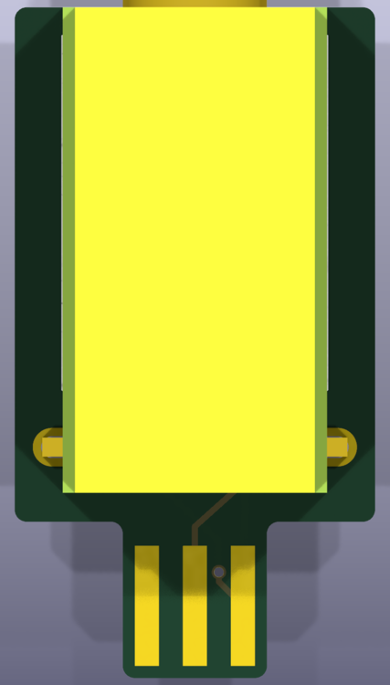
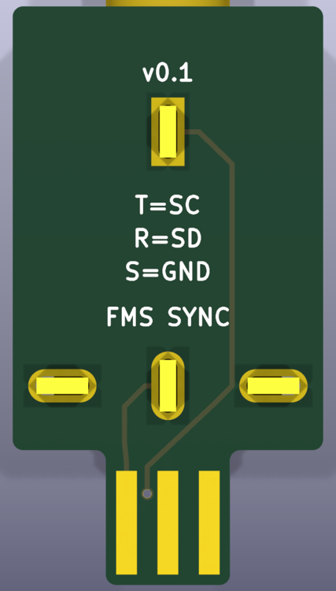

# FMS Link

A small PCB that plugs into a Game Boy link port and breaks the sync lines out to a
3.5mm TRS jack, for clocking [FMS](https://lo-bit.club/fms/) and
[nanoloop](https://nanoloop.com/) against other gear — Pocket Operators, Volcas,
eurorack, anything that takes an analog clock.

The jack is mounted **in line with the link port**, barrel pointing away from the
console, so the cable exits straight out the back of the adapter rather than off to
one side.




## Wiring

| TRS    | Game Boy link | Purpose      |
| ------ | ------------- | ------------ |
| Tip    | SC (pin 5)    | Serial clock |
| Ring   | SD (pin 4)    | —            |
| Sleeve | GND (pin 6)   | Ground       |

This matches the analog clock cable wiring in the
[FMS guide](https://lo-bit.club/fms/guide).

`VDD`, `SO` and `SI` are not connected. The jack's shunt terminal (pin 4) is the tip's
normalling contact — internally shorted to the tip when nothing is plugged in, and
released when a plug is inserted. It is left unconnected.

## Bill of materials

| Ref | Part               | Notes                                       |
| --- | ------------------ | ------------------------------------------- |
| J1  | **WQP-WQP729JH-B** | 3.5mm right-angle switched **stereo** jack  |

> **Order the blue `-B` part, not the red `-R`.** Per the
> [manufacturer datasheet](https://www.thonk.co.uk/wp-content/uploads/2022/10/WQP-WQP729JH.pdf),
> the `-R` is mono and has no ring contact, so it cannot carry `SD`.
> Thonk sells both on their [729JH page](https://www.thonk.co.uk/shop/729jh-jacks/).
>
> The Thonkiconn (`PJ398SM` / `WQP518MA` / `PJ301M-12`) is **not** a substitute: it is a
> vertical-mount mono jack with a different footprint.

The board is 15.0 × 27.9 mm including the link-port tongue, two layers, no other parts.
The jack's threaded barrel protrudes 4.3 mm past the top edge.

## Building

Made with KiCad 10. Open `fms-link.kicad_pro`.

Gerbers and the Excellon drill file are checked in under `gerbers/`, plotted from the
current board. The jack's four pins are routed slots, so make sure your fab accepts the
`G85` slot commands in the drill file (OSH Park and JLCPCB both do).

### Ordering from OSH Park

Zip the gerbers flat (no enclosing folder) and upload at
[oshpark.com](https://oshpark.com/):

```sh
cd gerbers && zip ../fms-link-gerbers.zip \
  fms-link-F_Cu.gtl fms-link-B_Cu.gbl \
  fms-link-F_Mask.gts fms-link-B_Mask.gbs \
  fms-link-F_Silkscreen.gto fms-link-B_Silkscreen.gbo \
  fms-link-Edge_Cuts.gm1 fms-link.drl
```

To replot from the board first:

```sh
kicad-cli pcb export gerbers --output gerbers/ \
  --layers "F.Cu,B.Cu,F.SilkS,B.SilkS,F.Mask,B.Mask,Edge.Cuts" fms-link.kicad_pcb
kicad-cli pcb export drill --output gerbers/ --format excellon \
  --drill-origin absolute --excellon-units mm fms-link.kicad_pcb
```

The board is 0.649 sq in, so OSH Park's 2-layer service runs about **$3.25 for three
copies** plus shipping. Check their rendered preview before checkout — in particular that
the four jack slots come through as slots rather than round holes.

## 3D model

`3dmodels/WQP729JH.wrl` is an approximate model of the jack, generated from
`3dmodels/WQP729JH.scad` against the manufacturer drawing, so the part shows up in
KiCad's 3D viewer.

> KiCad reads VRML units as 0.1 inch, so the footprint's `model` block carries
> `(scale 0.3937007874)` despite the mesh being authored in millimetres. If this is ever
> replaced with a STEP file, **reset that scale to 1**.

## Credits

The Game Boy link-port edge-connector footprint (`gb-link-socket`) and the board tongue
geometry come from Nick Palmer's
[gb-link-cable](https://github.com/Palmr/gb-link-cable) breakout board — the pad
positions and tongue outline are his, reformatted here for KiCad 10. That project in turn
followed [this devlog](http://obskyr.io/lanette/devlog/making-a-game-boy-link-cable-breakout-board/)
on building a link cable breakout, and he wrote up his own build
[on his blog](https://palmr.co.uk/posts/26-gameboy-link-cable-breakout/).

Everything else here — the TRS jack footprint and 3D model, the schematic, the board
outline and routing — is new.

The original project carries no license file, so it grants no explicit reuse terms; this
repository likewise asserts none over that borrowed geometry.
